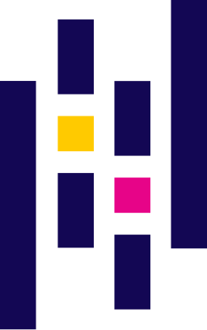
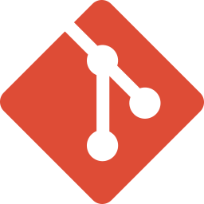

<h2 align="center">Technical stack</h2>

<!-- GIF справа -->

  

  
  
  

  

<table align="center" cellspacing="0" cellpadding="0">
  <tr>
    <td align="center" width="90">
      
    </td>
    <td align="center" width="90">
      
    </td>
    <td align="center" width="90">
      
    </td>
  </tr>
</table>

  

<table align="center">
  <!-- Первая строка — только Maven -->
  <tr>
    <td colspan="4" align="center">
      
    </td>
  </tr>
  <!-- Вторая строка -->
  <tr>
    <td></td>
    <td></td>
    <td></td>
    <td></td>
  </tr>
  <!-- Третья строка -->
  <tr>
    <td></td>
    <td></td>
    <td></td>
    <td></td>
  </tr>
  <!-- 4-я строка -->
  <tr>
    <td></td>
    <td></td>
    <td></td>
    <td></td>
  </tr>
</table>

---

  

---

<h2 align="center">Connect with me</h2>  

  
  

