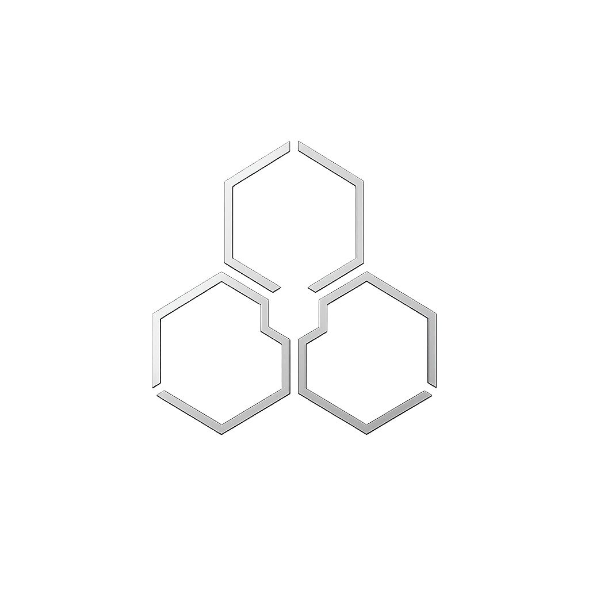

  

<h2 align="center">Technical stack</h2>

<table align="center" width="100%">
<tr>
<td width="50%" valign="top" align="center">

<h3 align="center">Hard-skills</h3>

  

</td>
<td width="50%" valign="top" align="center">

<h3 align="center">Processes</h3>

  
  
  
  
  

<h3 align="center">Languages</h3>

<table align="center">
<tr>
<th>Язык</th>
<th>Уровень</th>
<th>Прогресс</th>
</tr>
<tr>
<td><b>Русский</b></td>
<td>Нативный</td>
<td>🟣🟣🟣🟣🟣 100%</td>
</tr>
<tr>
<td><b>English</b></td>
<td>B2</td>
<td>🟣🟣🟣⚪⚪ 60%</td>
</tr>
</table>

</td>
</tr>
</table>

 

---

<h2 align="center">Projects</h2>

<table align="center" width="100%">

<tr>
<td width="25%" align="center">
  <h3> Pet Projects</h3>
</td>
<td width="25%" align="center">
  <h3> University Projects</h3>
</td>
<td width="25%" align="center">
  <h3> Hackathons</h3>
</td>
<td width="25%" align="center">
  <h3> Commercial Experience</h3>
</td>
</tr>

<tr>
<td colspan="4">
  

</td>
</tr>

<tr>

<td width="25%" valign="top" align="center">

  <b>Notification Subscription Platform</b>
   
  Событийная платформа уведомлений с подписками и доставкой через несколько каналов.
    
  <b>Stack:</b> Java, Spring Boot, PostgreSQL, RabbitMQ, JWT, Prometheus, Grafana, Zipkin
    
  

 

  <b>Smart Activity Tracker</b>
   
  Сервис для сбора пользовательских событий и расчёта базовой продуктовой аналитики.
    
  <b>Stack:</b> Java, Spring Boot, PostgreSQL, Flyway, OpenAPI, Prometheus, Grafana, Testcontainers
    
  

</td>

<td width="25%" valign="top" align="center">

  <b>Porta Trading System</b>
   
  Распределённая MVP-система для трейдинга с дашбордом, Kafka-событиями и состоянием портфеля.
    
  <b>Stack:</b> Java, Spring Boot, Kafka, PostgreSQL, Go, React, TypeScript, Docker
    
  

 

  <b>Visual Circuit Designer</b>
   
  Веб-инструмент для проектирования, симуляции и управления цифровыми логическими схемами.
    
  <b>Stack:</b> Next.js, React, Node.js, Express, Python, PostgreSQL, Docker, Grafana, Loki
    
  

</td>

<td width="25%" valign="top" align="center">

  <b>PingTower</b>
   
  Система мониторинга сайтов и сервисов с дашбордом, алертами и статистикой надёжности.
    
  <b>Stack:</b> Java 21, Spring Boot, React, PostgreSQL, ClickHouse, Docker, Nginx
    
  

 

  <b>DatsPulse</b>
   
  Python-бот с модульной архитектурой для автоматизации и реализации пользовательских стратегий.
    
  <b>Stack:</b> Python
    
  

</td>

<td width="25%" valign="top" align="center">

  
   
  <b>ATLAS</b>
   
  Персональная AI-система для управления режимом, спортом, восстановлением, привычками, питанием и прогрессом.
    
  <b>Stack:</b> Java 21, Spring Boot, PostgreSQL, Flyway, Maven, Docker, Telegram Bot API, JUnit 5
    
  

 

  <b>Trade360Lab</b>
   
  Платформа для исследования, подготовки данных, запуска и сравнения торговых сценариев.
    
  <b>Stack:</b> Java, Spring Boot, Python, FastAPI, PostgreSQL, Next.js, Docker, GitHub Actions
    
  

</td>

</tr>
</table>

 

---

<table align="center">
<tr>
<td align="center" width="40%">
  
</td>
<td align="center" width="60%">
  
</td>
</tr>
</table>

<h2 align="center">Contacts</h2>

  
  &nbsp;&nbsp;
  

